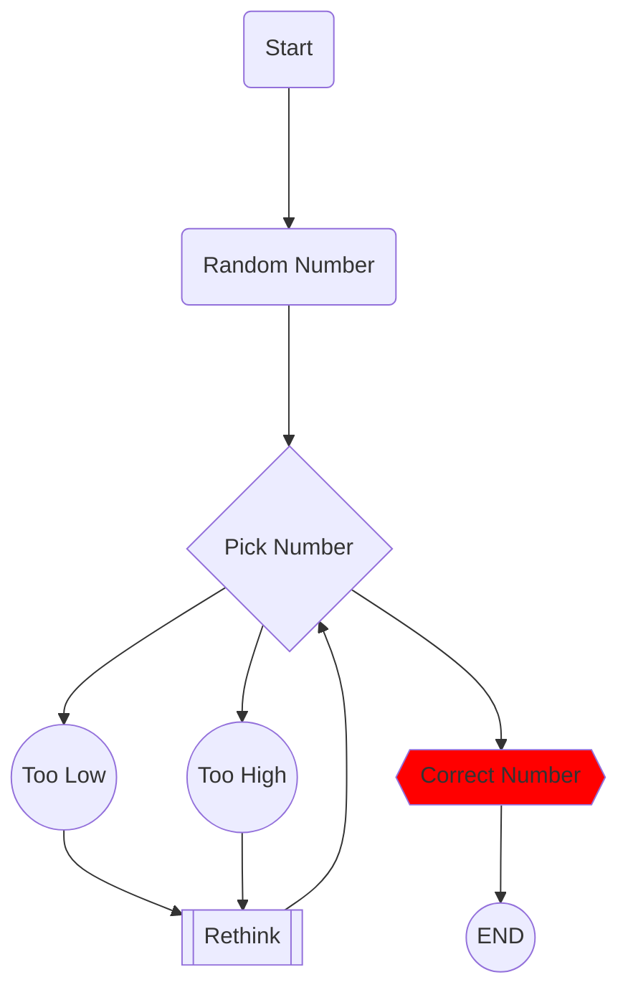

---
Guessing Game
---

```mermaid
flowchart TD
A(Start) ---> B(Random Number) ---> 
C{Pick Number}
D((Too High))
C --> E((Too Low)) --> R
C --> D -->R[[Rethink]] --> C
J:::someclass
classDef someclass fill:#FF0000
C --> J{{Correct Number}} -->
GA@{shape: circle, label: "END"}
```
